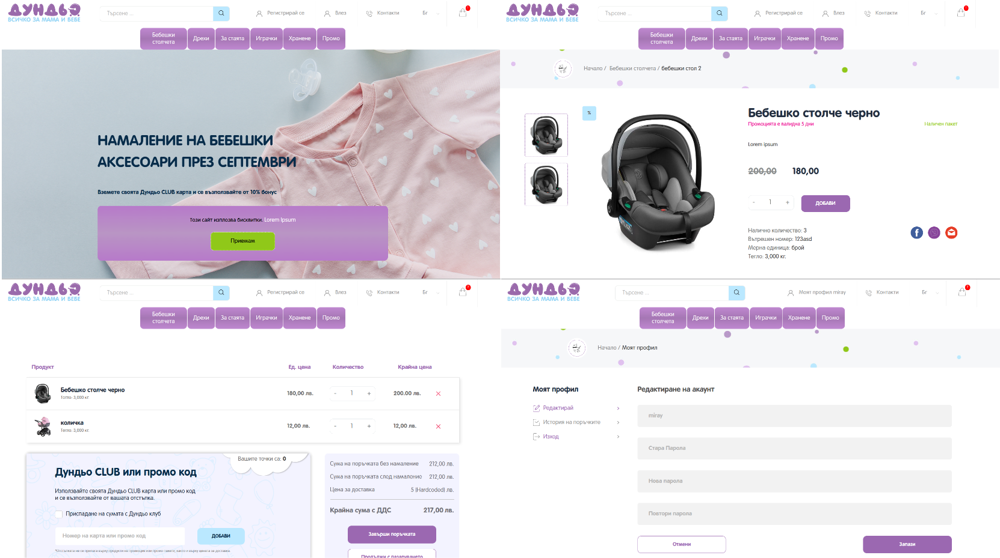

# Dundio - E-Commerce Store



## Table of contents
* [Technologies](#technologies)
* [Features](#features)
* [Setup](#setup)

## Technologies
#### Django Full-Stack
#### JavaScript
#### PostgreSQL
#### Others: Git, ORM, DTL, MPTT, Rosetta, Model Translations

## Features

#### User Role Based Authentication and Authorization
- Fully custom implementation
- Profile Management: Users can view and edit their profile information.

#### Products/Orders/Categories Management:
- Hierarchically nested categories implemented with Django MPTT

#### Promotional Codes and Packages

#### ShoppingCart:
- OOP driven implementation

#### Signals

#### Decorators:
- Manages access based on whether users are logged in or not

#### Middleware:
- Attaches the authenticated user object to the request based on the custom_user_id stored in the session, allowing access to the user information throughout the request lifecycle.

#### Custom Context Processor:
- Provides active categories, footer elements, and the shopping cart data to all templates

#### Sending Emails:
- Sending email confirmations for registration and password recovery

#### Images upload

#### Searching:
- Dynamic search bar implemented with JS that suggests items based on first letters of a search

#### Admin Panel:
- Numeric and autocomplete filters, inline editing.

#### Multilingual Website:
- Used Django Rosetta and Model Translations to enable multiple language support.

#### Template System:
- Used DTL for dynamic templates, with partials and a base template for reusability.

## Setup
#### Make sure:
- You have installed Python 3.8 or higher.
- You have a working internet connection.

### 1. Open a terminal in a folder and `clone` the repository:
```
git clone https://github.com/miray-mustafov/Dundio.git
```
### 2. Navigate to the project directory:
```
cd Dundio
```
### 3. Create a virtual environment:
```
python -m venv venv
```
### 4. Activate the virtual environment:
#### On Windows:
```
venv\Scripts\activate
```
#### On macOS/Linux:
```bash
source venv/bin/activate
```
### 5. Install the required packages:
```
pip install -r requirements.txt
```
### 6. Prepare a RDBMS (f.e. PostgreSQL) and set the variables in .env:
### 7. Apply migrations to the database & create a superuser:
```
python manage.py migrate
python manage.py createsuperuser
```

### Final step:
To start the application, ensure you are **in the project directory** and the **virtual environment is activated**. Then run:
```
python manage.py runserver
```
### *Enjoy!*
